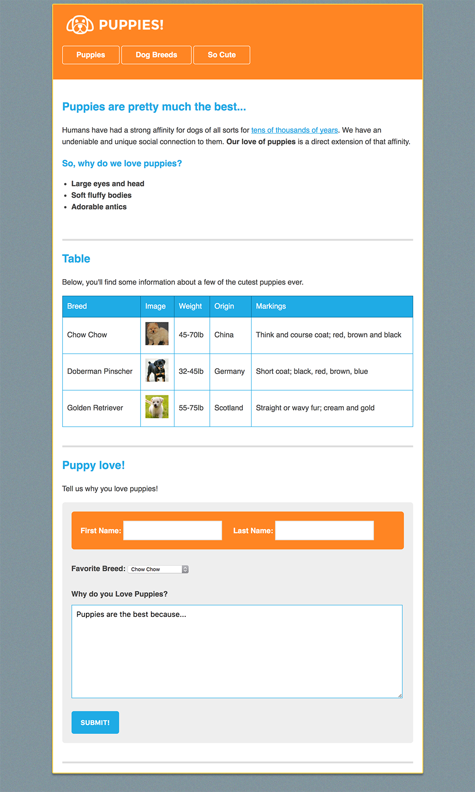

TODO:

A completed commit was pushed. However I need to revisit this to address the following:

1. Make this look appropriate on tablets and mobile devices. To do this Chrome's dev tools.
2. Make gh-pages branch (or gh_pages branch).
3. Push to gh-pages.

from: https://newline.theironyard.com/cohorts/15/courses/9/projects/39

Your task is to review index.png and index.html and to write the CSS to match the mockup listed below.

Getting Started

Inside, you'll find a resources folder and a starter_files folder. The resources folder contains the screenshot of the final HTML page, but you can just use the one below.

The starter_files folder contains the starter HTML file, the img folder (containing all of the images for the page), and a blank CSS file. The CSS file is already linked up to the HTML file, so you can go ahead and code away with your styles.

Mockup  

